# Tutorial: From `system start` to Ready-to-Trigger

A newcomer's walk through every step the gateway takes between the moment you run
`ductile system start` and the moment a job can actually fire. Each step cites the
real source location, and each gate explains *why it refuses* — because in ductile,
the refusals are load-bearing.

!!! abstract "Provenance"
    Built from the repo's knowledge graph (graphify, 5,409 nodes) — boot spine traced via
    `runStart()` → `buildRuntime()`, then verified line-by-line against
    `cmd/ductile/runtime.go`.

## 1. The big picture

Ductile is an integration gateway: plugins do side-effects, the core owns all orchestration
(*"plugins stay dumb"* — AGENTS.md, Idiom 3). Boot is therefore not "open a port and go";
it is a sequence of **refusal gates** followed by the assembly of four **trigger planes** that
all converge on one queue and one dispatcher. If any gate fails, the gateway does not limp — it
refuses to start, loudly, with the reason.

```mermaid
flowchart TD
    A["<b>ductile system start</b><br/><small>CLI entry · main.go:31 → runtime.go:908</small>"]
    B["Config resolution & load (with vault decrypt)<br/><small>runtime.go:916–937</small>"]
    C["PID lock — exactly one instance<br/><small>runtime.go:939</small>"]
    D["buildRuntime(): symlink scan → plugin discovery<br/><small>runtime.go:352–401</small>"]
    E["Admission gates: integrity check · doctor · strict decode<br/><small>runtime.go:443–499</small>"]
    F["SQLite open → pipelines compiled → config snapshot<br/><small>runtime.go:508–571</small>"]
    G["Queue · state stores · event hub · scheduler · admitter<br/><small>runtime.go:573–610</small>"]
    H["Boot posture decision + privsep boot gate<br/><small>runtime.go:641–714</small>"]
    I["Dispatcher · relay · scheduler start · API bind · webhooks<br/><small>runtime.go:716–881</small>"]
    J["<b>READY</b> — signal loop supervising, four trigger planes live<br/><small>runtime.go:967–993</small>"]

    A --> B
    B -->|"refuses: no config found / vault load error"| C
    C -->|"refuses: another instance running"| D
    D -->|"refuses: symlinks (unless allowed), discovery failure"| E
    E -->|"refuses: drift, invalid config, unknown keys"| F
    F --> G
    G --> H
    H -->|"refuses: capability/accounts mismatch, side-doors (strict)"| I
    I -->|"refuses: token resolution fails, bind fails"| J

    style D stroke:#ff7b72
    style E stroke:#ff7b72
    style H stroke:#c792ea
    style J stroke:#7ee08a
```



## 2. Phase 0 — CLI entry & config resolution

1. `main()` hands straight to `runCLI()` (`cmd/ductile/main.go:31,35`) — a noun-verb CLI;
   `system start` routes to `runStart()` (`cmd/ductile/runtime.go:908`).

2. **Config resolution**, in strict precedence (`runtime.go:916–929`):

    1. `--config <path>` (file or directory) — "explicit"
    2. `$DUCTILE_CONFIG_DIR` — "env"
    3. auto-discovery (e.g. `~/.config/ductile/config.yaml`) — "auto-discovered"

    The chosen *source* is remembered and logged, so you can always tell which config won.

3. **`config.LoadWithVault()`** (`runtime.go:933`) loads and deep-merges the config files
   (a directory means `config.yaml` plus its `include:` files — plugins.yaml, pipelines.yaml,
   api.yaml, webhooks.yaml) *and* decrypts the vault **exactly once**. The decrypted owner is
   threaded through the whole boot so nothing decrypts twice.

4. **PID lock** (`runtime.go:939–944`) — `lock.AcquirePIDLock()` guarantees a single instance.
   A second `system start` fails here with "another instance may be running".

5. A **`reloadManager`** is created (`runtime.go:947–952`) — this is the named supervisor that
   later handles `SIGHUP`/`system reload` by building a whole new runtime and restoring the old
   one if the new one fails.

!!! note "Why a single load-time vault decrypt?"
    The vault is the only place secrets live (api tokens are vault-only on the release path).
    Resolving the owner once and passing it down means the admission gates, the posture decision,
    and secret delivery all see the *same* vault presence — resolving it twice caused real
    bugs (#134).

## 3. Phase 1 — Hygiene & plugin discovery

Everything from here to readiness lives in `buildRuntime()` (`cmd/ductile/runtime.go:352`) —
the highest-betweenness hub in the knowledge graph (54 edges), because boot *and* reload both
run through it.

1. **Logging up first** — `log.Setup(cfg.Service.LogLevel)` (`runtime.go:353`), so every
   subsequent refusal has a voice.

2. **Symlink scan** (`runtime.go:356–371`) — `CollectConfigPaths` + `DetectSymlinks` walk every
   config path. Symlinks are warned, and if `service.allow_symlinks` is false the boot is
   **refused**. A symlinked config is a config you didn't review.

3. **Plugin discovery** (`runtime.go:373–393`) — `resolvePluginRoots()` then
   `plugin.DiscoverManyWithOptions()` scans each `plugin_roots` directory for `manifest.yaml`
   files (protocol v2). Discovery builds the **registry**: what exists on disk, what commands
   each plugin supports.

4. **Aliases applied** (`runtime.go:394–401`) — a config entry with `uses:` registers one plugin
   under another name (e.g. two `sys_exec` instances with different argv allowlists).

5. **Preflight report** (`runtime.go:403–435`) — the log states every config file loaded,
   plugins discovered vs configured vs enabled, and the API listen address. Read this block
   first when debugging a boot.

!!! note "Newcomer note"
    Discovery ≠ enablement. A plugin found on disk does nothing until `plugins.yaml` enables it,
    and it cannot be *used* by a pipeline until routing references it. Config declares; the core
    controls flow.

## 4. Phase 2 — Admission gates (the bouncers)

Ductile's admission policy (`runtime.go:443`) is a set of independent switches (decomplected
from the old bundled `strict_mode`). Each one can refuse the boot:

| Gate | What it checks | Where |
|---|---|---|
| `verify_integrity_on_boot` | Recomputes checksums of every config file against the **.checksums file** written by `config lock`. With `fail_on_drift`, any edit since the lock refuses the boot. | `runtime.go:460–466` |
| `validate_config_on_boot` | Runs the **doctor** (`doctor.New(cfg, registry).Validate()`) — plugin refs, routes, webhooks, token scopes, hook cycles, schedules. Vault-aware: a from-scratch vault gateway with no api token yet is a legitimate bootstrap posture, not an error (#129). | `runtime.go:468–481` |
| Strict decode | YAML decoding is lenient, so a typo'd key would be *silently dropped* — you'd believe a setting is active when it is not. Every dropped key is warned always; under `validate_config_on_boot` it is an admission **failure** (#26). | `runtime.go:491–499` |

!!! note "Why gates instead of warnings?"
    The constitution calls these the *load-bearing refusals*: a gateway that starts on drifted
    or invalid config will fail later, at trigger time, in a way that is much harder to diagnose.
    Fail-closed at boot is the cheap failure.

## 5. Phase 3 — State, routing & the snapshot

1. **Database opens** — `storage.OpenSQLite(ctx, cfg.State.Path)` (`runtime.go:508`). One SQLite
   file holds the job queue, job logs, plugin facts/state, contexts, circuit breakers,
   transitions, and the audit trail. (In the knowledge graph, `OpenSQLite()` bridges 30+
   communities — nearly everything touches it.)

2. **Scheduled commands validated** against the registry (`runtime.go:516`) — a schedule naming
   a command the plugin doesn't support refuses the boot.

3. **Pipelines compile** — `router.LoadFromConfigFiles()` (`runtime.go:532–543`) turns the
   `pipelines:` YAML into compiled routes (the DSL compiler: steps, `if:` conditionals, fan-out
   edges, max route depths). Every registered pipeline is logged with its trigger.

4. **Config snapshot recorded** — `configsnapshot.Build()` + `Insert()` (`runtime.go:545–571`).
   The exact config (hash, source, ductile version, binary path, **plugin fingerprints**) is
   written to the DB with reason `startup`. Every job later created carries this snapshot ID —
   you can always answer *"what config was live when this job ran?"*

5. **Core plumbing** (`runtime.go:573–610`): `queue.New()` (with dedupe TTL and the snapshot-ID
   provider), `state.NewStore()`, `state.NewContextStore()`, `events.NewHub(256)`,
   `scheduler.New()`, and `state.NewAdmitter()` (caps context payload bytes at admission).

## 6. Phase 4 — Security posture (vault & privsep)

1. **Secret delivery wired** (`runtime.go:618–633`) — if a vault owner exists, it becomes the
   `SecretComposer` (spawn-time, stdin-delivered secrets) and a `pluginVerifier` is created:
   **compose-time attestation** re-verifies a plugin's live bytes against its recorded keyed
   fingerprint *right before* handing it secrets (ADR §3.3). Changed bytes ⇒ no secrets.

2. **Boot posture decided** — `config.DecideBootPosture()` (`runtime.go:641–645`). Two postures:

    - **Gateway** (normal): api tokens resolve, everything opens.
    - **Management-only** ("vault-operable / ductile-closed"): a vault exists but no api token
      yet — the credential-ladder bootstrap. Only `/vault/*` on a local unix socket is served;
      *no* trigger plane opens.

    The fail-closed guard still refuses a from-scratch gateway with API enabled, zero tokens,
    and no vault to bootstrap from.

3. **Privsep boot gate** — `dispatch.BootGate(cfg)` (`runtime.go:651–714`, #86). The capability
   to drop privilege and the configured `accounts:` table must *agree*, or startup is refused —
   never a silent run at gateway privilege. Three outcomes:

    - **Enforcing**: plugins drop to their resolved account. The filesystem floor is reconciled
      (`ReconcileAccountFilesystem`, #87 — secrets 0600/0700, per-account 0700 dirs,
      all-or-refuse), and each account is probed for root side-doors (`AuditAccountSideDoors`,
      #111 — nopasswd sudo, docker group, writable setuid). Strict mode refuses on a side-door.
    - **Unconfined override**: accounts exist but `service.unconfined` forces gateway-uid
      execution — warned loudly, never silent.
    - **Hygiene-only**: no accounts configured (dev box) — posture logged explicitly so
      "valid config" is never mistaken for "enforcing" (#101).

!!! note "Why is posture decided before any plane opens?"
    Every plane that could fire a pipeline — scheduler, dispatcher, public listener, webhooks —
    is gated on the posture (#136). In management posture, no pipeline can fire and no secret
    can be composed until an operator mints an api token over the admin socket and runs
    `system reload` to activate the gateway.

## 7. Phase 5 — Trigger planes come up

1. **Dispatcher built** — `dispatch.New(q, st, contextStore, router, registry, hub, cfg, …)`
   (`runtime.go:716–720`), carrying the admitter, secret composer, plugin verifier, and the
   privsep-enforce flag. This is the engine that will execute every job.

2. **Relay receiver** configured (`runtime.go:722`) — accepts signed event envelopes from
   remote ductile instances.

3. **Recovery hooks wired** (`runtime.go:731`) — when crash recovery marks a dead orphan job,
   the dispatcher's hook machinery fires (e.g. a `job-failure-notify` pipeline).

4. **Scheduler & dispatcher start** (`runtime.go:738–752`) (gateway posture only). The scheduler
   begins evaluating cron/interval entries; the dispatcher starts its worker loop polling the
   queue.

5. **API tokens resolve, fail-closed** — `config.ResolveAPITokens()` (`runtime.go:767–780`).
   Bearer tokens are `secret_ref`s into the vault; an unresolvable or empty ref **aborts the
   boot** — the API never opens authenticating against an empty credential (card #94).

6. **Listener reserved synchronously** — `apiServer.Bind()` (`runtime.go:822–826`) happens
   *before* serving, so an activation reload whose bind fails fails the reload (and the old
   runtime is restored) instead of answering "ok" and dying later (#140). Then `Start()`
   serves — or `StartManagement()` serves only `/vault/*` on the unix socket in management
   posture (`runtime.go:834–852`).

7. **Webhook server** (`runtime.go:864–881`) — if endpoints are configured (and posture is
   gateway), the webhook listener opens with per-endpoint HMAC signature verification.

## 8. Phase 6 — Ready: the supervisor loop

1. Back in `runStart()`: the PID lock is logged, macOS **TCC paths are pre-warmed**
   (`runTCCPrewarm`, `runtime.go:966`) so Full-Disk-Access prompts happen now, not mid-job.

2. `"ductile running"` is logged (`runtime.go:967`) and the process enters its supervision
   loop (`runtime.go:972–993`):

    - `SIGHUP` → `manager.Reload()`: build a complete new runtime through the same
      buildRuntime gates; on failure the old runtime keeps running.
    - `SIGINT` / `SIGTERM` → orderly stop.
    - Any component error on `errCh` → supervisor stops the gateway (exit 1) — the service
      manager (launchd/systemd/docker) restarts it. Let-it-crash, applied at the operator layer.

3. Verify from outside: `curl http://127.0.0.1:8080/healthz` reports status and the boot
   posture; `ductile system status` gives the operator view.

## 9. Now trigger a job

The gateway is "ready" precisely because four independent **trigger planes** are now live, and
all of them converge on the same path: **enqueue → queue (dedupe, concurrency keys, breaker) →
dispatcher `ExecuteJob()` → plugin subprocess**.

| Plane | What it does | Where |
|---|---|---|
| **API** | Authenticated `POST` runs a plugin command or pipeline; sync or async. | `internal/api/server.go` · `handlers.go` |
| **Webhook** | HMAC-verified external POST (e.g. GitHub) routes into a pipeline. | `internal/webhook/server.go` |
| **Scheduler** | Cron/interval entries enqueue plugin commands on their tick. | `internal/scheduler/` |
| **Relay** | Signed envelopes from a remote ductile instance are admitted and routed. | `internal/relay/receiver.go` |

The simplest first job, via the API plane:

```bash
# 1. health — confirms posture is "gateway"
curl -s http://127.0.0.1:8080/healthz

# 2. trigger the echo plugin synchronously
curl -s -X POST http://127.0.0.1:8080/plugins/echo/run \
  -H "Authorization: Bearer $DUCTILE_TOKEN" \
  -H "Content-Type: application/json" \
  -d '{"payload": {"message": "hello, ductile"}, "sync": true}'

# 3. inspect what happened — full lineage, attempts, config snapshot
ductile job inspect <job-id>
```

!!! note "What happens inside"
    The API handler authenticates the bearer token and its scopes, the **admitter** checks the
    context payload size, `queue.New()`'s dedupe logic drops replays inside the TTL, the job row
    is stamped with the active **config snapshot ID**, and the dispatcher picks it up: resolves
    the plugin and its account (privsep), verifies its fingerprint (if vaulted secrets are
    involved), spawns the subprocess with payload as `DUCTILE_PAYLOAD_*` env, captures the
    protocol-v2 JSON response, records facts/state updates, evaluates routing for successor
    steps, and finalizes the job. `ductile job inspect` shows you every one of those decisions
    after the fact.

### Where to go next

- [Tutorial: Bootstrap — genesis to `/healthz`](bootstrap.md) — the credential ladder that gets you here
- [ARCHITECTURE](../ARCHITECTURE.md) — the component map you just walked through
- [8 Idioms of Ductile](../8_IDIOMS_OF_DUCTILE.md) — why the design refuses what it refuses
- [Getting Started](../GETTING_STARTED.md) & [Cookbook](../COOKBOOK.md) — recipes for real pipelines
- [Operator Guide](../OPERATOR_GUIDE.md) §3 — the admission gates in operator terms
- [ADR: Vault credential ladder](../adr/vault-credential-ladder.md) — the management-posture bootstrap in full

---

*Generated 2026-06-10 from the ductile knowledge graph (graphify) + line-verified against
`cmd/ductile/runtime.go` @ main (99d909a). If boot code moves, regenerate via
`/graphify query` — the graph is the map.*
