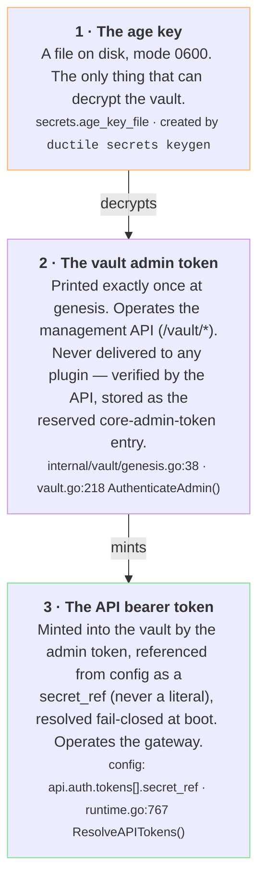

# Tutorial: Bootstrap — Genesis to `/healthz`

From an empty directory to a locked, vault-native gateway answering
`curl http://127.0.0.1:8080/healthz` — with no secret ever written into a config file.
This explainer teaches the **credential ladder**: the age key, the vault, minting the admin
token, minting and using the API token, and the practices that keep all of it honest.

!!! abstract "Provenance"
    Built from the repo's knowledge graph (graphify) — traced via the `Credential Ladder`
    concept node (docs/BOOTSTRAP.md §The shape) and the `vault.Init()` genesis cluster, then
    verified against `internal/vault/genesis.go`, `cmd/ductile/vault.go`, and
    `cmd/ductile/runtime.go`.

## 1. The credential ladder — the whole idea

Ductile's bootstrap answers a chicken-and-egg problem every secure system has: *the gateway
needs a token to serve, but the token should live in the vault, and the vault is operated
through the gateway.* The answer is a ladder — every credential is issued by the one above it,
and **nothing is ever written into a config file**:



!!! note "Why a ladder and not a setup wizard?"
    Each rung has one job and one custody boundary. Compromise of an API token never exposes
    the vault; compromise of config files exposes *no* secret at all (they contain only
    `secret_ref` names). And because the ladder is also the **recovery path** (lose a rung →
    climb back up from the rung above), there is no separate, rarely-tested recovery procedure
    to rot.

## 2. Rung 1 — Genesis: the age key and the vault

Start with a config directory that has **no tokens at all** — the repo's `config/` folder is a
working copy of exactly this state:

```bash
CFG=~/.config/ductile

# config.yaml must carry, at minimum:
#   secrets:
#     age_key_file: age.key
#     vault_file: vault.age
#   plugin_roots:
#     - plugins            # at least one EXISTING dir; "~" expands, relative paths resolve against $CFG
#   api:
#     enabled: true
#     listen: "127.0.0.1:8080"
#     management_socket: /tmp/ductile-admin.sock   # explicit + SHORT (see good practice)
#
# Do NOT add api.auth.tokens yet — that absence is the point.

# Daemon stopped. Generate the age key, then create the vault:
ductile secrets keygen --out "$CFG/age.key"
ductile vault init --vault "$CFG/vault.age" --key "$CFG/age.key"
```

What `vault init` actually does — `vault.Init()` (`internal/vault/genesis.go:38`):

1. **Refuses to clobber**: if `vault.age` already exists, init errors out (`genesis.go:39–44`).
   A re-init can never silently wipe a live vault's secrets (fail-closed, Armstrong-style).

2. **Seeds the reserved `core` principal** with a freshly generated 32-byte **fingerprint
   nonce** (`genesis.go:59`) — this nonce later keys plugin attestation (a plugin's recorded
   fingerprint is HMAC'd with it).

3. **Mints the admin token** (32 random bytes) and stores it as the reserved
   `core-admin-token` entry via the sanctioned `RotateAdminToken` path (`genesis.go:63`).
   It has *no* `authorized_principals`: it is verified by the API, never composed/delivered
   to any plugin.

4. **Saves the first encrypted blob** — age-encrypted with your key, written atomically
   (`writeFileAtomic` + directory fsync, `vault.go:328,365`).

5. **Prints the admin token exactly once.** It is not recoverable in plaintext afterward
   without the key. Capture it into 0600 custody now (see good practice), then shred the
   capture.

!!! danger "The admin token prints once."
    If you lose it before capturing it, you haven't lost the vault —
    `ductile vault rotate-admin-token` (daemon stopped, age key present) mints a replacement
    in place (`cmd/ductile/vault.go:294`). The age key is the rung above; it can always
    re-issue rung 2.

## 3. The management posture — a gateway that is deliberately closed

Now seal and validate, then boot. A config with the API enabled and **zero**
`api.auth.tokens` is *not* an error when a vault is present — it is the recognized
**bootstrap state** (#129):

```bash
# Lock FIRST, then check — scope files (webhooks.yaml) are checksum-verified
# even by `config check`, and zero-tokens + genesis-vault IS a clean verdict.
ductile config lock --config "$CFG"
ductile config check --config "$CFG"

# First boot:
ductile system start --config "$CFG" &
ductile system status --config "$CFG"     # expect: boot_posture: management-only (live)
```

At boot, `config.DecideBootPosture()` (`cmd/ductile/runtime.go:641`) sees *vault present + no
API token* and chooses the management posture. The two postures side by side:

| | management-only · "vault-operable, ductile-closed" | gateway · normal serving posture |
|---|---|---|
| `/vault/*` | ✓ on a local **unix socket** only | ✓ still available to the admin token |
| Public TCP listener | ✗ never opened | ✓ (after fail-closed token resolution) |
| Webhooks | ✗ closed | ✓ (HMAC-verified) |
| Scheduler | ✗ gated, no ticks | ✓ live |
| Dispatcher | ✗ gated, no jobs | ✓ live |
| `/healthz` | — | ✓ reports `"posture": "gateway"` |
| Where | `runtime.go:738–752, 835–849` (#136) | `runtime.go:822–852` |

!!! note "Why gate every trigger plane, not just the listener?"
    "Vault operable" and "ductile operable" are different trust states. Until an operator has
    minted credentials, *no pipeline may fire and no secret may be composed* — a scheduler tick
    firing a half-bootstrapped pipeline would be an unaudited action. The boot log says this
    loudly (`runtime.go:848`): it's a named, intentional posture — "waiting for an api token",
    never "stuck".

## 4. Rung 2 — The admin token: operating `/vault/*`

The management socket is the only door right now, and the admin token is the only key to it.
Every `/vault/*` request authenticates via `Vault.AuthenticateAdmin()`
(`internal/vault/vault.go:218`) against the stored `core-admin-token` entry. Through this
plane you can:

| Operation | Command | Notes |
|---|---|---|
| Store / mint a secret | `vault set --name <n> --pattern manual` | Value via **stdin, never argv** — argv is visible in `ps` and shell history. |
| Register a plugin principal | `vault register-principal` | Refuses the reserved `core` name — genesis-only seeding. |
| Roll / revoke secrets | `vault roll · revoke · roll-principal …` | Lifecycle verbs; every action lands in the append-only vault audit. |
| Rotate the vault encryption key | `vault rotate-key` | Re-encrypts the blob under a new age key. |
| Rotate the admin token itself | `vault rotate-admin-token` | Offline (daemon stopped), needs the age key — rung 1 re-issues rung 2. |

!!! note "Separate credential domain."
    The admin token operates the vault but cannot run a single pipeline; the API token runs
    pipelines but cannot read a raw secret back out (`vault get` is admin-plane). Keep the two
    in different custody if different people hold those duties.

## 5. Rung 3 — Minting and using the API token

1. **Generate a strong token value yourself** (you are choosing the credential; the vault is
   its custody):

    ```bash
    API_TOKEN=$(openssl rand -hex 32)
    ```

2. **Mint it into the vault over the unix socket** — stdin for the value, admin token for
   authority:

    ```bash
    printf '%s' "$API_TOKEN" | ductile vault set \
      --api-url "unix:///tmp/ductile-admin.sock" \
      --token "$ADMIN_TOKEN" \
      --name core-api-token --pattern manual
    ```

3. **Reference it from config — by name, never by value.** Stop the daemon, then add:

    ```yaml
    api:
      auth:
        tokens:
          - secret_ref: core-api-token
            scopes: ["*"]        # first token is the operator token; scope later tokens narrowly
    ```

    At boot, `ResolveAPITokens()` (`runtime.go:767–780`) resolves every `secret_ref` against
    the vault, **fail-closed**: an unresolvable or empty ref aborts the boot — the API never
    opens authenticating against an empty credential.

!!! note "Scopes are part of the mint, not an afterthought."
    `"*"` is for your operator token. Tokens for automations should carry only what they use —
    e.g. `["jobs:read"]` for a dashboard, `["plugins:run"]` for a trigger-only client. The
    doctor validates scope names at boot (`doctor.go:271`).

## 6. Seal, activate, verify

```bash
# Seal config and plugins — ORDER MATTERS:
#   config lock writes the .checksums file that plugin lock extends,
#   and both must come after genesis (attestation is keyed by the vault nonce).
ductile config lock --config "$CFG"
ductile plugin lock --all --config "$CFG"        # prints a confirm code
ductile plugin lock --all <code> --config "$CFG"

# Boot the gateway (under your service manager in real deployments):
ductile system start --config "$CFG"

# ── The finish line ──
curl -s http://127.0.0.1:8080/healthz            # "posture": "gateway"

# Prove the token works and the audit trail is intact:
curl -s http://127.0.0.1:8080/jobs -H "Authorization: Bearer $API_TOKEN"
ductile system vault-audit --config "$CFG"       # genesis + mint recorded
```

What changed at this boot: `DecideBootPosture()` now sees a configured token, the posture is
**gateway**, tokens resolve fail-closed, the listener is reserved synchronously (`Bind()`
before serve, `runtime.go:822` — #140), and every trigger plane opens. The same transition
works *without* a restart-from-scratch during recovery: an armed management-posture box
activates on `system reload` once the token ref resolves.

## 7. Good practice — custody, rotation, recovery

### Custody

- **Age key**: 0600, owned by the gateway user, on the gateway host only. It is rung 1 —
  anyone holding it holds the vault. Under enforced privsep, boot reconciles the whole secrets
  surface to gateway-owned 0600/0700 and **refuses to start** otherwise
  (`runtime.go:688–692`, #87).
- **Admin token**: capture the one-time print into a password manager or 0600 file
  immediately, then shred the capture file (`shred -u` / `rm -P`). Don't export it in
  dotfiles; pass it per-invocation.
- **API token values** exist in exactly two places: the vault, and the client that uses them.
  Configs carry only `secret_ref` names — safe to commit, sync, and back up. `config view`
  redacts sensitive values for the same reason.
- **Secrets enter via stdin, never argv** — argv leaks through `ps`, shell history, and audit
  logs.

### Rotation — each rung rotates independently

| Rung | Command | When |
|---|---|---|
| Age key | `ductile secrets rotate` / `vault rotate-key` | Key custody change, scheduled hygiene. Re-encrypts the blob; secrets untouched. |
| Admin token | `ductile vault rotate-admin-token` (daemon stopped) | Operator turnover, suspected exposure, or simply lost — rung 1 re-issues it. |
| API token | `vault roll` the secret, then `system reload` | Routine. The `secret_ref` in config never changes — only the vault value does. |

### Recovery is the same ladder, climbed again

- **Lost API token?** Remove the `api.auth.tokens` block, restart → the daemon is back in
  management posture; mint a new token over the socket. The bootstrap path *is* the recovery
  path — it stays tested because it's the same code (#129/#136).
- **Lost admin token?** `vault rotate-admin-token` with the age key, daemon stopped.
- **Lost age key?** That is the one unrecoverable rung — the vault blob is ciphertext without
  it. Back the key up under separate custody from the vault file; the pair together is the
  secret, separately they are inert.

### Sanity rules that bite (from the field)

- Unix socket paths cap near **104 bytes** (`sun_path`) — set `api.management_socket`
  explicitly and keep it short (`/tmp/…` or beside the state DB, `runtime.go:890`).
- The daemon **refuses** to boot if the management socket path points at an existing
  non-socket file — it will not delete your file.
- A config cannot *activate* while any configured `secret_ref` is unminted — mint everything
  you reference before the activating restart, or stage those includes until after bootstrap.
- Lock order: `config lock` before `plugin lock` (the latter extends the former's
  `.checksums`), and both *after* genesis (attestation is keyed by the vault nonce from
  rung 1).
- Verify after every change: `system status` for posture, `system vault-audit` for the
  append-only credential history, `/healthz` for the outside view.

### Where to go next

- [Tutorial: From `system start` to ready-to-trigger](boot-sequence.md) — what happens *inside* each boot
- [BOOTSTRAP](../BOOTSTRAP.md) — the canonical from-scratch procedure this page explains
- [ADR: Vault credential ladder](../adr/vault-credential-ladder.md) — the design rationale in full
- [SECRETS](../SECRETS.md) — the secrets model beyond bootstrap (principals, compose, attestation)
- [DEPLOYMENT](../DEPLOYMENT.md) §5b — privsep postures for production hosts

---

*Generated 2026-06-10 from the ductile knowledge graph (graphify) + verified against
`internal/vault/genesis.go`, `cmd/ductile/vault.go`, `cmd/ductile/runtime.go`, and
`docs/BOOTSTRAP.md` @ main (99d909a). Companion page:
[boot sequence tutorial](boot-sequence.md).*
