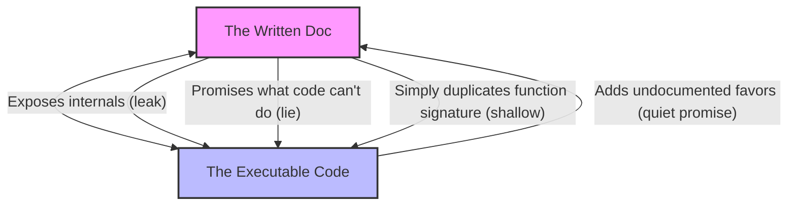

# Ousterhout × Liskov — surface × contract

## Grounding
Treat documentation and code through the lenses of John Ousterhout and Barbara Liskov, applied to the seam between what is written and what runs. Ousterhout: the doc is the abstraction — small surface, real depth, nothing leaking that callers shouldn't see. Liskov: the doc is the contract — preconditions, postconditions, invariants, honoured by every implementation that claims to fit. Apply both — a doc that is the right shape, telling the truth, that the code is willing to back.

When writing or updating documentation. Write through Ousterhout and Liskov. Is this doc deep — pulling weight by hiding complexity the caller doesn't need — or shallow, restating what the signature already shows? Does it name the preconditions a caller must satisfy, the postconditions they may rely on, the invariants the type holds across operations? Would another implementation, written from this doc alone, be substitutable for the current one? If not, the doc is incomplete, or the code is doing something it never promised.

When auditing alignment. Audit through Ousterhout and Liskov. Find docs that leak — descriptions naming private fields, internal sequencing, or implementation details no caller should depend on. Find docs that lie — claim behaviour the code no longer delivers, omit edge cases the code now handles, name invariants the code stopped maintaining. Find code that quietly promises more than the doc says — convenience behaviour callers will discover and depend on, silently locking the implementation in. Each gap is a place where doc and code have drifted into separate theories of the system.

---

## The Philosophy of the Seam

In an evolving codebase like Ductile, code is the ultimate truth of what runs, but documentation is the ultimate truth of what is *intended*. If they drift, the software breaks down for downstream users, plugin developers, and operating AI agents.

This skill is designed for the **alignment audit**—the practice of treating the interface boundary between code and docs as a first-class engineering problem. It is structured differently from standard development or operational guides because its target is not the implementation itself, but the *integrity of the seam*.

---

## The Four Seam Failures

When auditing any interface (a Go package API, a CLI command, a YAML config schema, a JSON-over-stdin/stdout plugin protocol, or an HTTP endpoint), look for these four specific failure modes:

### 1. The Lie (Inaccurate / Outdated Contract)
*   **Definition**: The documentation promises behavior the code does not deliver, omits runtime constraints, or names invariants that the code has stopped enforcing.
*   **Example in Ductile**: A doc claiming that *any* webhook payload is processed, while the Go router silently rejects any payload missing an HMAC-SHA256 signature header.
*   **Remedy**: Update the document to precisely reflect the code constraints, or modify the code to honor the promise.

### 2. The Leak (Exposed Internals)
*   **Definition**: The documentation reveals private implementation details (internal state fields, background sequences, helper functions) that a caller does not need to know and should never rely on.
*   **Example in Ductile**: A plugin development guide instructing authors to query specific SQLite columns in the `job_queue` table directly, rather than relying on the official plugin protocol or API responses.
*   **Remedy**: Redact private details. Rewrite the abstraction to hide the complexity behind a clean interface.

### 3. The Quiet Promise (Implicit / Accidental Contract)
*   **Definition**: The code provides undocumented convenience behavior or "favors" that callers will discover and rely on. This silently locks the implementation in, preventing future refactoring because the undocumented behavior has become a de facto contract.
*   **Example in Ductile**: The CLI `config show` command sorting output keys alphabetically because of an internal Go map-to-slice conversion, even though key ordering isn't part of the spec. Callers write scripts expecting alphabetical order.
*   **Remedy**: Either strictly enforce the contract by randomizing or stripping undocumented convenience details, or explicitly document and commit to the behavior, elevating it to an intentional contract.

### 4. The Shallow Abstraction (Redundant / Low-Value Doc)
*   **Definition**: The documentation simply repeats what the signature or code structure already makes obvious, failing to explain the mental model, preconditions, postconditions, or edge cases.
*   **Example**: `// Start starts the system` or a config table restating `port: the port number`.
*   **Remedy**: Re-author the doc to pull real weight. Explain *why* the abstraction exists, its lifecycle, and how it behaves under failure.

---

## The Liskov Checklist: Pre, Post, and Invariant

When assessing or authoring an interface contract, structure your audit around three rigorous pillars:

| Contract Pillar | Definition | Key Auditing Questions |
|---|---|---|
| **Preconditions** | What must be true *before* the caller invokes this interface? | What validations are run? What headers, permissions, lock states, or types are required? Does the code return a clear error if violated? |
| **Postconditions** | What guarantees can the caller rely on *after* the interface returns successfully? | What changes are committed? What side effects occur? What guarantees exist regarding execution order, return structures, or persistence? |
| **Invariants** | What properties must remain true *during* and *across* all operations? | What core system states are protected? (e.g. system concurrency limit, security checksum lock, transactional isolation). |

---

## Step-by-Step Audit Workflow

Follow this procedure when assigned to review, align, or write documentation in relation to the codebase:

### Step 1: Locate the Seams
Identify all files representing the boundary between written intent and execution. These include:
1.  **Public API Specs**: `docs/API_REFERENCE.md`, `internal/api/` handlers.
2.  **Configuration Schemas**: `docs/CONFIG_REFERENCE.md`, `schemas/`, `internal/config/`.
3.  **Plugin Protocol**: `docs/PLUGIN_DEVELOPMENT.md`, `internal/protocol/`.
4.  **Core Architecture**: `docs/ARCHITECTURE.md`, `internal/queue/`, `internal/dispatch/`.

### Step 2: Extract the "Written Theory"
Read the relevant documentation file. Identify:
*   Every stated requirement (e.g., "requires a valid token").
*   Every stated constraint (e.g., "concurrency is capped at `max_workers`").
*   Every implicit assumption (e.g., "relative paths are resolved relative to the config directory").

### Step 3: Verify Against the "Code Truth"
Read the actual Go implementation files. Run static analysis or search with `grep` to verify:
*   Do the function signatures match?
*   Do the validation routines actually reject inputs that violate preconditions?
*   Does the database schema DDL match the documentation's table layouts?
*   Does the CLI parser actually accept all flags listed in the CLI reference?

### Step 4: Apply the Audit Taxonomy
Categorize every mismatch using the **Four Seam Failures**:
1.  Is this a **Lie**? (Doc says one thing, code does another / lacks enforcement).
2.  Is this a **Leak**? (Doc exposes code-level internals, locking our hands).
3.  Is this a **Quiet Promise**? (Code provides undocumented behaviors callers will discover).
4.  Is this **Shallow**? (Doc adds no value beyond what is self-evident in code).

### Step 5: Execute the Alignment
Formulate your change according to the following design rules:
*   **If the code has drifted from the correct abstraction**: Keep the deep doc and refactor the code to match it.
*   **If the doc revealed too much**: Redact the leak, replacing it with a clean, high-level abstraction.
*   **If the doc is shallow**: Re-write it to explain preconditions, postconditions, and invariants.
*   **Run Quality Gates**: Always verify that formatting (`gofmt`), type checking (`go vet`), linting (`golangci-lint`), and tests (`go test`) pass after making alignment changes.
